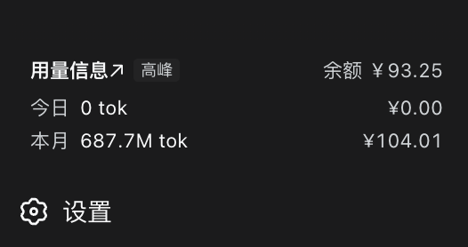

# dsh-usage-stats

DeepSeek Harness 插件：侧边栏左下角（设置按钮上方）显示**今日 / 本月** token
消耗、费用与**账户余额**。

点击卡片标题「用量信息↗」可打开 DeepSeek 开放平台，查看官方详细用量数据。

## 效果预览



## 安装

```sh
dsh plugin --profile web add ./dsh-usage-stats   # 或发布后: github:<owner>/dsh-usage-stats
```

安装后重启 `dsh web`。

## 配置 token（可选）

不配置也能用（此时显示 DSH 本地用量估算）。要显示**官方精确数据与余额**，
创建 `~/.dsh/dsh-usage-stats.json`：

```json
{ "platformToken": "你的 userToken" }
```

userToken 获取：打开 platform.deepseek.com → F12 → Application →
Local Storage → `https://platform.deepseek.com` → 复制 `userToken` 的 value。
改文件即生效。

不想手动填也可以**自动扫描本机浏览器**（Chrome / Edge / Brave / Arc），显式开启
（默认关闭）：

```json
{ "autoScan": true }
```

## 数据来源

- **官方口径**（配置 token 后）：与 platform.deepseek.com/usage 页面一致，
  为账号全量数据（含其他客户端用量）
- **本地口径**（兜底）：只统计 DSH 自己花掉的用量，费用为估算
- 卡片显示「官方」徽标表示当前是官方数据

## 卸载

```sh
dsh plugin --profile web remove dsh-usage-stats
```

## License / 致谢

MIT（见 [LICENSE](LICENSE)）；架构参考 [dsh-liquid-glass-balance-card](https://github.com/SoDaZilla-zzz/dsh-liquid-glass-balance-card)、
折叠逻辑改编自 [dsh-token-stats](https://github.com/F1shn/dsh-token-stats)（均为 MIT）。
