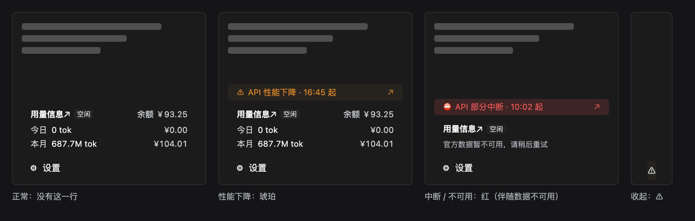

# dsh-usage-stats

[](https://en.wikipedia.org/wiki/Vibe_coding)

DeepSeek Harness 插件：侧边栏左下角（设置按钮上方）显示**今日 / 本月** token
消耗、费用与**账户余额**；在用量卡片上方提示 **DeepSeek 服务状态**（只在有影响的
故障时出现）；并在左上角品牌行（`deepseek HARNESS` 右侧）检测**是否有新版** DSH，
有则显示「有新版」徽章。

点击卡片标题「用量信息↗」可打开 DeepSeek 开放平台，查看官方详细用量数据。
点击「有新版」徽章可打开 [deepseek-harness Releases](https://github.com/deepseek-ai/deepseek-harness/releases)。
服务状态提示点击后打开对应的故障公告。

> 🤖 **Vibe coding 项目**：功能、测试与文档由 AI agent 协作产出（vibe coding），**未经人工逐行审查，请谨慎用于生产环境**。

## 功能介绍

三个功能，各占侧边栏一个位置，互不遮挡：

| 功能 | 位置 | 说明 | 细节 |
|---|---|---|---|
| **用量信息** | 左下角，设置按钮上方 | 今日 / 本月 token 消耗与费用、账户余额，附「高峰 / 空闲」时段标签；点标题跳官方用量页。数据是**账号全量**（含其他客户端用量）。 | [配置 token](#配置-token) · [数据来源](#数据来源) |
| **API 告警** | 用量卡片正上方 | DeepSeek 服务状态：**只在有影响时出现**。琥珀 = 性能下降，红 = 中断 / 不可用；点开对应故障公告；收起侧边栏时变成 `⚠` 图标。正常时这一行在 DOM 里根本不存在。 | [服务状态提示](#服务状态提示) |
| **版本升级** | 左上角品牌行右侧 | DSH 有新版时显示「有新版」徽章，点开 Releases；无更新则隐藏。 | [检测新版](#检测新版) |

三个功能有一条共同的失败纪律：**拿不到数据就闭嘴，不猜**。用量拉不到显示「暂不可用」而不是 0；服务状态拉不到就不显示提示（问不到 ≠ 出问题）；npm 请求失败不缓存、下次重试但也不报错。

## 效果预览

真机截图（正常状态）：


API 告警只在官方**真的**出故障时才出现，所以正常截图里看不到它。下面这张是用插件自己的
CSS 与 DOM 渲染出来的三种形态——**不是真机截图**（真机得等下一次官方故障）：



从左到右：正常（没有这一行）/ 性能下降（琥珀）/ 中断·不可用（红，通常伴随「官方数据暂不可用」）/
收起侧边栏（整项变成 `⚠`）。

## 安装

```sh
dsh plugin --profile web add ./dsh-usage-stats   # 或发布后: github:<owner>/dsh-usage-stats
```

安装后重启 `dsh web`。

## 配置 token

插件只使用**官方用量、费用与余额**，需要有效的 token。
创建 `~/.dsh/dsh-usage-stats.json`：

```json
{ "platformToken": "你的 userToken" }
```

userToken 获取：打开 platform.deepseek.com → F12 → Application →
Local Storage → `https://platform.deepseek.com` → 复制 `userToken` 的 value。
改文件即生效。

不想手动填也可以**自动扫描本机浏览器**（Chrome / Edge / Brave / Arc），显式开启
（默认关闭）：

```json
{ "autoScan": true }
```

### autoScan 工作原理与已知限制

autoScan 会读取各浏览器 profile 的 `Local Storage/leveldb`，启发式提取
`platform.deepseek.com` 的 `userToken` 候选，再逐个发往 DeepSeek 校验，选有效的那个。

因为 Chrome 的 LevelDB 在压缩（compaction）时可能把一条记录的 **key 和 value 分散到
不同 SSTable 文件**，且 localStorage 值实际以 `{"value":"...","__version":"0"}` 形式存储，
纯文本扫描有时抓不到（或抓到**其他网站的旧 token**，校验会返回 40003 无效）。

插件为此做了两处收敛（`scanBrowserTokens`）：

- 优先收集**含 `platform.deepseek.com` origin 文件**里、长度在 `55–85` 的独立 base64
  运行（按接近 65 排序），能命中有效 token 并天然排除其他网站/旧记录的 token；
- 再用 `userToken` key / origin / `"value":"` **marker 邻近候选**兜底；
- 候选上限 `MAX_CANDIDATES`（40），并记住"已穷尽"状态，避免无有效 token 时每次查询
  重复校验全部候选。

**仍非 100% 可靠**（跨 SSTable 是 Chrome 固有限制）。若 autoScan 显示
`scanHint`（未找到有效 token），最稳的做法是手动填 `platformToken`。

## 检测新版

插件在左上角品牌行（`deepseek HARNESS` 右侧）检测 DSH 是否有新版：

- **判定**：读取运行中 DSH 的版本（与 `dsh --version` 同源，取自其 `package.json`），
  对比 npm 上 `@deepseek-ai/dsh` 的 `dist-tags.latest`；最新版比本地新即显示「有新版」，
  无更新则隐藏。支持 `-rc.N` 预发布版本比较。
- **频率**：本地缓存 1 小时、页面低频轮询（版本变更极低频），避免频繁请求 npm。
- **点击**：只跳转 [deepseek-harness Releases](https://github.com/deepseek-ai/deepseek-harness/releases)，
  不会误触发品牌行的「新建会话」（已做点击冒泡隔离）。
- 失败的 npm 请求不会被缓存，下次自动重试。

## 服务状态提示

用量卡片上方会显示一行 **DeepSeek 服务状态**，**只在有影响时出现**（正常时 DOM 里没有这一行）：

- **数据源**：`status.deepseek.com/history.rss`。状态站是 JS 渲染的页面（HTML 里只有标题），
  Statuspage 式 `/api/v2/*` 返回 404，**RSS 是唯一机器接口**；抓取在 Host 侧做
  （状态站没有 CORS 头，浏览器直接 fetch 拿不到），Host 缓存 5 分钟、客户端 5 分钟轮询一轮。
- **「有影响」的判定**（三条同时成立）：最新一条故障**未恢复** + 发布在 **12 小时**内 +
  受影响组件里有名字带 **`API`** 的。已恢复的历史、搜索/上传/对话服务异常都不提示
  （别为与你无关的故障分心）。
- **形态**：与用量卡片同宽的一行，文字与「用量信息」左对齐；琥珀 = 性能下降，
  红 = 中断/不可用；点击跳对应故障公告；悬停看完整标题与受影响组件；收起侧边栏时该行变成 `⚠` 图标。
- **拉不到状态时不显示任何东西**：问不到 ≠ 出问题，宁可沉默也不误报。

> 已知未验证项：RSS 是否收录「进行中」的故障条目，只在真实故障时才能确认（写这段时全站正常，
> feed 里 30 条全是已恢复）。若它其实只发历史，此功能不会触发——换个源即可，判定逻辑不用动。

## 数据来源

- **用量 / 费用 / 余额的唯一数据源是官方平台**（配置有效 token 后），为账号全量数据
  （含其他客户端用量）；服务状态另走 `status.deepseek.com` 的 RSS（见上）。
- 不监听本地请求、不统计会话、不维护价格表；token 和金额均来自官方接口。
- 保留“高峰 / 空闲”时段提示，沿用北京时间工作日 9–12、14–18 为高峰、周末及其他时段为空闲的展示规则；该标签不参与用量或金额计算。
- 未配置或 token 无效时显示配置提示；官方请求失败时显示暂不可用，不以零用量替代。
- 今日使用官方小时桶，本月使用官方日桶，两者可能有不同的更新延迟。

## 卸载

```sh
dsh plugin --profile web remove dsh-usage-stats
```

## License / 致谢

MIT（见 [LICENSE](LICENSE)）；架构参考 [dsh-liquid-glass-balance-card](https://github.com/SoDaZilla-zzz/dsh-liquid-glass-balance-card)。
早期本地统计逻辑曾参考 [dsh-token-stats](https://github.com/F1shn/dsh-token-stats)（MIT），现已移除。
